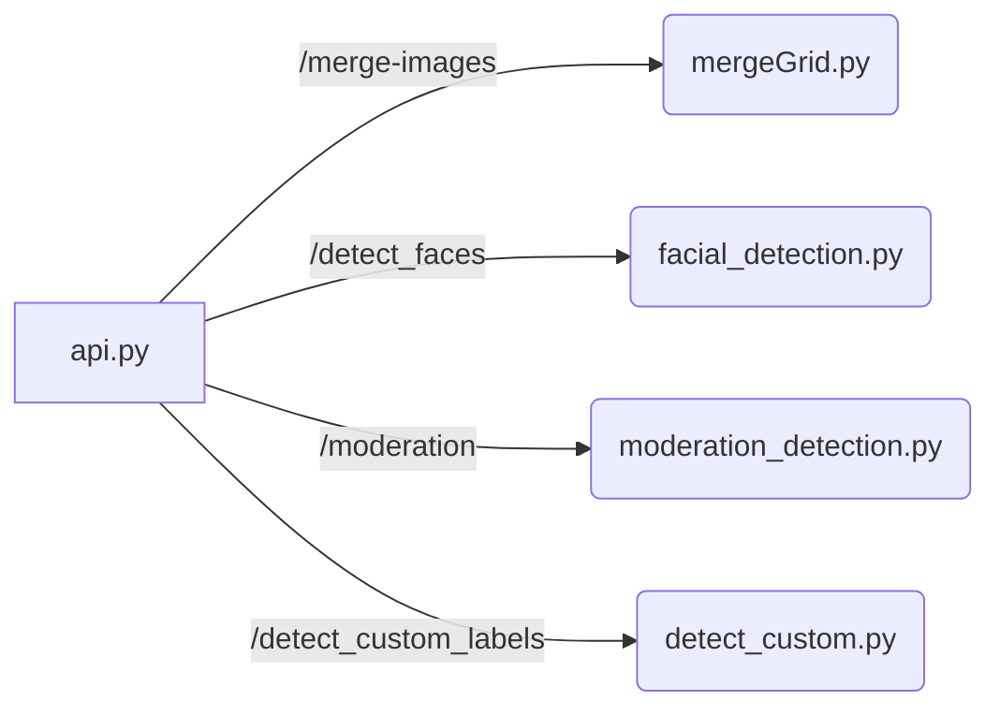
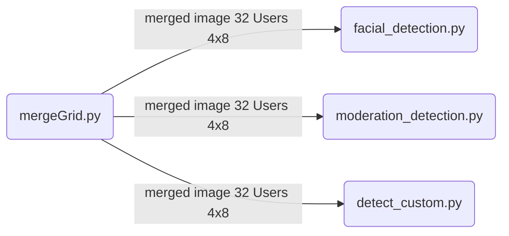

# Facial Analysis API

Facial Analysis API includes four endpoints for merging images, detecting faces, moderation, and detecting custom labels. 

The **Facial Analysis API** specifically uses the following AWS Rekognition APIs:

* *DetectFaces API*: This API is used to detect faces in images. It can extract facial features such as emotions, age range, gender, and facial landmarks.

* *DetectModerationLabels API*: This API is used to detect moderation labels in images. It can detect labels such as nudity, violence, and suggestive content.

* *DetectCustomLabels API*: This API is used to detect custom labels in images using a trained custom labels model. It can detect any type of custom label that the model has been trained to recognize, such as logos, specific objects, or unique features.

## ENDPOINTS 

-  **/merge-images**
The endpoint expects a POST request with a JSON payload containing the following parameters:

    - images: An array of objects that represent the images to be merged. Each object should contain two properties:
        - bucket_name: The name of the S3 bucket where the image is stored
        - prefix: The key of the image object in the S3 bucket
        - grid_size: An array that specifies the number of rows and columns in the grid. The first element of the array represents the number of rows, and the second element represents the number of columns.
        - merged_bucket: The name of the S3 bucket where the merged image will be stored

    ~~~
    {
        "images": [
            {
                "bucket_name": "rekognition.bucket",
                "prefix": "32users/dummyUser-000.jpg"
            },
            {
                "bucket_name": "rekognition.bucket",
                "prefix": "32users/dummyUser-001.jpg"
            },
            ...
            {
                "bucket_name": "rekognition.bucket",
                "prefix": "32users/dummyUser-030.jpg"
            },
            {
                "bucket_name": "rekognition.bucket",
                "prefix": "32users/naughty_woman.png"
            }
        ],
        "grid_size": [4, 8],
        "merged_bucket": "rekognition.bucket"
    }
    ~~~

    ### Usage

    To use the API, make a *POST* request to the **/merge-images** endpoint with the JSON payload containing the required parameters. The API will retrieve the images from the specified S3 buckets, merge them into a single image in a grid format, and save the merged image to the specified S3 bucket.

    The API response is a string that indicates whether the image merging process was successful or not. If successful, the response will indicate that the images have been merged.

    ~~~
    Success - 32 images merged!
    ~~~

- **/detect_faces** 
The endpoint expects a POST request with a JSON payload containing the following parameters:

    - bucket_name: The name of the S3 bucket where the image is stored
    - prefix: The key of the image object in the S3 bucket

    ~~~
    {
        "bucket": "rekognition.bucket",
        "img_path": "temp/merged_image.png"
    }
    ~~~

    ### Usage

    To use the API, make a *POST* request to the **/detect_faces** endpoint with the JSON payload containing the required parameters. The API will retrieve the image from the specified S3 bucket, detect faces in the image using Rekognition, and return a list of face data containing the age range, and highest confidence emotion of each detected face in the image.

    Other possible data that can be extracted:
    Facial landmarks: the location of key points on the face, such as the eyes, nose, and mouth.
    * Age and gender: the age range and gender of the detected face.
    * Emotions: the emotions expressed by the detected face, such as happy, sad, angry, etc.
    * Facial hair: the presence and amount of facial hair, including mustaches, beards, and sideburns.
    * Glasses: whether the detected face is wearing glasses and the type of glasses.
    * Eyes open/closed: whether the detected face's eyes are open or closed.
    * Mouth open/closed: whether the detected face's mouth is open or closed.
    * Smile: whether the detected face is smiling and the confidence level of the smile detection.
    * Pose: the estimated pose of the detected face, including the roll, pitch, and yaw angles.
    * Quality: the quality of the detected face image, including the sharpness and brightness.

    The API response is a JSON object that contains the detected face data.

    ~~~
        {
            "face_data": [
                {
                    "grid_position": 0,
                    "age_range": [
                        20,
                        32
                    ],
                    "Highest Confidence Emotion": {
                        "Confidence": 99.56,
                        "Type": "HAPPY"
                    }
                },
                {
                    "grid_position": 1,
                    "age_range": [
                        25,
                        35
                    ],
                    "Highest Confidence Emotion": {
                        "Confidence": 95.23,
                        "Type": "SAD"
                    }
                },
                {
                    "grid_position": 2,
                    "age_range": [
                        28,
                        40
                    ],
                    "Highest Confidence Emotion": {
                        "Confidence": 88.9,
                        "Type": "SURPRISED"
                    }
                },
                {
                    "grid_position": 3,
                    "age_range": [
                        35,
                        45
                    ],
                    "Highest Confidence Emotion": {
                        "Confidence": 91.34,
                        "Type": "ANGRY"
                }
            }
        ]
    }
    ~~~

- **/moderation** 
The endpoint expects a POST request with a JSON payload containing the following parameters:

    - bucket: The name of the S3 bucket where the image is stored
    - img_path: The key of the image object in the S3 bucket

    ~~~
    {
        "bucket": "rekognition.bucket",
        "img_path": "temp/merged_image.png"
    }
    ~~~

    ### Usage

    To use the API, make a *POST* request to the /moderation endpoint with the JSON payload containing the required parameters. The API will retrieve the image from the specified S3 bucket, detect moderation labels in the image using Rekognition, and return a list of moderation label data containing the grid position and labels of each detected moderation label in the image.

    The API response is a JSON object that contains the detected moderation label data.

    ~~~
   {
        "GridPos": 0,
        "Labels": [
            {
                "Name": "Violence",
                "Confidence": 97.0
            }
        ]
    },
        "GridPos": 1,
        "Labels": [
            {
                "Name": "Nudity",
                "Confidence": 93.0
            }
        ]
        
    }
    ~~~

- **/detect_custom_labels**
The endpoint expects a POST request with a JSON payload containing information about an image in an S3 bucket and a Rekognition Custom Labels model. The endpoint returns a JSON response containing the grid positions and labels for custom labels detected in the image.

The request payload includes the following parameters:

    - bucket: The name of the S3 bucket containing the image.
    - photo: The name of the image in the S3 bucket.
    - min_confidence (optional): The minimum confidence score required for a label to be considered a match. Default value is 7.
    - model: The ARN of the Rekognition Custom Labels model to use for detection.

    ~~~
    {
        "bucket": "rekognition.bucket",
        "photo": "temp/merged_image.png",
        "min_confidence" : 6,
        "model": "arn:aws:rekognition:********"
    }
    ~~~

    ### Usage

    To use the API, make a *POST* request to the /detect_custom_labels endpoint with the JSON payload containing the required parameters.
    The endpoint calls the **show_custom_labels** function with the request parameters to detect custom labels in the image using the specified model. It then calls the **display_image** function to draw bounding boxes around the detected labels and return the grid positions and labels for each detected label.

    The **display_image** function loads the image from the S3 bucket and draws a grid of 4x8 rectangles on the image. For each detected label, the function draws a bounding box around the label and calculates which grid position the label falls into. It then appends the grid position and label to a result array and returns the result array.

    The **show_custom_labels** function calls the AWS Rekognition DetectCustomLabels API with the specified image, minimum confidence score, and Custom Labels model ARN. It returns the API response.

    This endpoint is used to detect custom labels in an image using a AWS Rekognition Custom Labels model and return the grid positions and labels for each detected label.

    ~~~
    {
        "grid_positions_and_labels": [
            {
                "gridPos": 0,
                "label": "cat"
            },
            {
                "gridPos": 2,
                "label": "dog"
            },
            {
                "gridPos": 5,
                "label": "tree"
            }
        ]
    }
    ~~~
